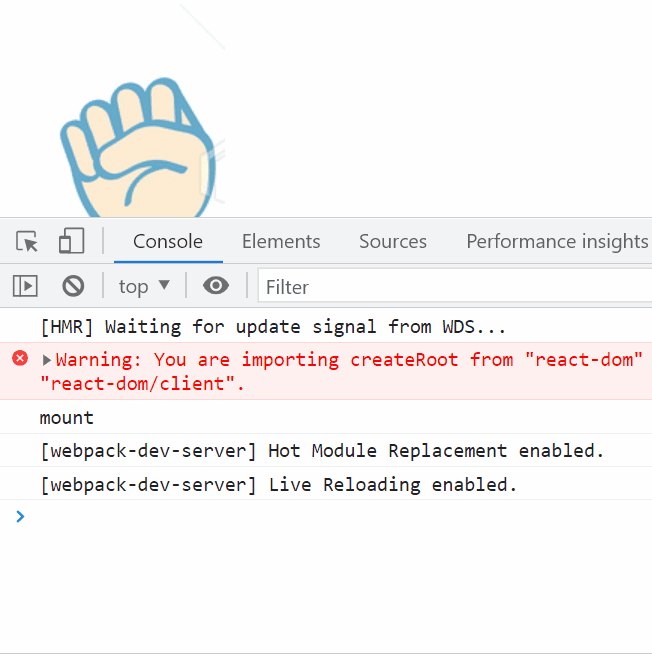
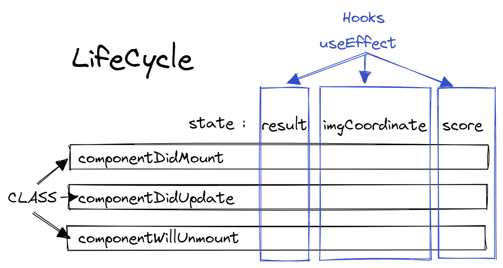

# Notes 

## react class의 LifeCycle

1. `componentDidMount()`
  - 컴포넌트 첫 렌더링 된 후 실행
  - 리렌더 될 때는 실행안됨. 처음에만.
  - 비동기 요청을 많이 한다.

2. `componentDidUpdate()`
  - componentDidMount는 첫번째에만 실행되는데 이건 리렌더링 후에 실행된다.

3. `componentWillUnmount()`
  - 컴포넌트 제거되기 직전 실행
  - componentDidMount에서 했던 작업을 제거하는 용도
  - 비동기 요청 정리를 많이 한다.

---

### 렌더되는 순서

1. constructor
2. render
3. ref 설정
4. componentDidMount

- setState/props 바뀔 때
  1. shouldComponentUpdate(true일 때)
  2. render
  3. componentDidUpdate

- 부모가 자식을 없앨 때
  1. componentWillUnmount
  2. 소멸

## 비동기 함수안에서 바깥의 변수를 참조하면 클로저가 발생한다.(js)

## react 패턴
1.
```js
  onClickBtn = (choice) => {
    ...
  }

  <button onClick={() => this.onClickBtn("바위")}>바위</button>
  <button onClick={() => this.onClickBtn("가위")}>가위</button>
  <button onClick={() => this.onClickBtn("보")}>보</button>
```
2.
```js
  onClickBtn = (choice) => () => {
    ...
  }

  <button onClick={this.onClickBtn("바위")}>바위</button>
  <button onClick={this.onClickBtn("가위")}>가위</button>
  <button onClick={this.onClickBtn("보")}>보</button>
```
- 1번 onClick을 간단하게 하기 위해서 2처럼 바꿀 수 있다.
- `= () => () => {}`

## useEffect
- componentDidMount, componentDidUpdate, componentWillUnmount 3개의 역할을 한다.

```js
  useEffect(() => {
    interval.current = setInterval(changeHand, 500);
    console.log("mount");
    // componentDidMount, componentDidUpdate 역할

    return () => { //componentWillUnmount
      clearInterval(interval.current);
      console.log("unmount");
    }
  }, [imgCoord])
```
- return 부분이 componentWillUnmount 역할
- 두번째 인수 배열에 넣은 값들이 바뀔 때 useEffect가 실행된다.

### useEffect는 componentDidMount랑 1:1 대응이 안된다.
- class를 사용했을 때가 더 가위바위보를 쉽게 구현할 수 있다.


- gif를 보면 mount되고 unmount 되는 게 반복되는 게 보인다.
- 즉 매번 clearInterval을 하기 때문에 그냥 setTimeout을 하는 것과 동일하다.

## class와 hooks의 LifeCycle 차이점


- class는 componentDidMount...등 한번에 다 state를 처리할 수 있다.
- hooks는 state 하나씩 처리한다. (두개씩..또는 전체를 처리할 수도 있다.)

## custom Hooks
- hooks를 직접 만들 수 있다.

```js
import { useRef, useEffect } from "react";

const useInterval = (callback, delay) => {
  const savedCallback = useRef();

  useEffect(() => {
    savedCallback.current = callback;
  });

  useEffect(() => {
    const tick = () => {
      savedCallback.current();
    };

    if (delay !== null) {
      let id = setInterval(tick, delay);
      return () => clearInterval(id);
    }
  }, [delay]);

  return savedCallback.current;
}

export default useInterval;
```
- useInterval.js 파일을 따로 만들고 커스텀 훅을 만들었다.

```js
  useEffect(() => {
    interval.current = setInterval(changeHand, 500);
    // componentDidMount, componentDidUpdate 역할

    return () => { //componentWillUnmount
      clearInterval(interval.current);
    }
  }, [imgCoord])
```
- 이 예제와 다르게 useInterval는 delay 부분이 null이 되면 멈추게 된다.

```js
  useInterval(changeHand, isRunning ? 100 : null);
```
- isRunning이란 boolean state를 만들었다.
- 가독성도 더 좋아졌다.