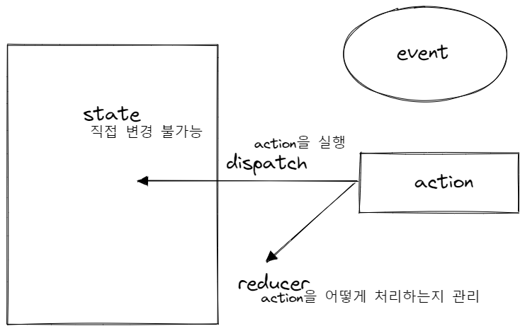

# Notes

## useReducer
- 리덕스와 비슷한 효과를 낼 수 있다.


TicTacToe -> Table -> Tr -> Td

클릭하는 것 : td
td에게 state를 전달하기 위해서 TicTacToe에서 Table -> Tr -> Td 식으로 전달해야 한다.

  


```js
  const [winner, setWinner] = useState("");
  const [turn, setTurn] = useState("O");
  const [tableDate, setTableData] = useState([["","",""], ["","",""], ["","",""]])
```

```js
const initialState = {
  winner: "",
  turn: "O",
  tableDate: [["","",""], ["","",""], ["","",""]],
}

const reducer = (state, action) => {
  switch (action.type) {
    case "SET_WINNER":
      return { //값을 직접 바꾸면 안된다.
        ...state,
        winner: action.winner,
      }
  }
}

const TicTacToe = () => {
  const [state, dispatch] = useReducer(reducer, initialState)

  const onClickTable = useCallback(() => {
    console.log("hi")
    dispatch({type: "SET_WINNER", winner: "O"});
  }, [])
```

- dispatch안에 들어가는 걸 action이라고 부른다. (리덕스에서 따온 개념)
- `dispatch({type: "SET_WINNER", winner: "O"});` dispatch가 액션을 실행한다.
- 액션만 있다고 해서 자동으로 state가 바뀌는 건 아니고 이 액션을 해석해서 직접 바꿔주는 역할이 필요하다 : reducer
- action의 `type` : 액션의 이름
- action이름은 대문자로 하는 게 보통의 규칙
  - `const SET_WINNER = "SET_WINNER";` 상수 변수로 빼두는 게 좋다.


- react, useReducer는 비동기적으로 바뀐다. 리덕스는 동기적으로 바뀜
- state를 바꾸고 바로 console.log를 찍으면 전 값이 나온다.
- 비동기적으로 뭔가를 처리할 때는 useEffect를 쓴다.